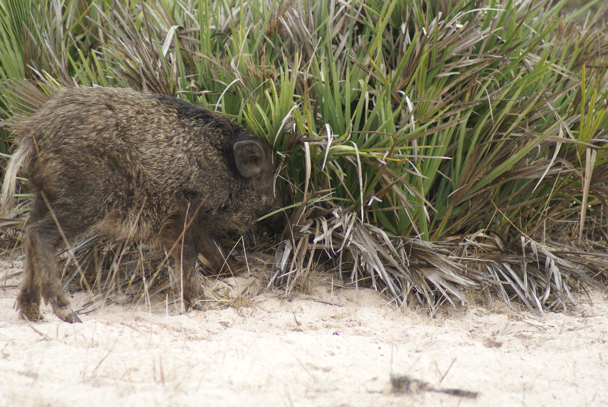

-------------------------
<div style="width:350px; height=150px">

</div>

&nbsp;

####**Step 1. **Analysis of the aggregation area of each dwarf palm through *Dirilichet tesselations* . We use the coordinate of both males and females to obtain a proxy of aggregation.  
&nbsp;
```
library(deldir)
```

```
martcoord<-read.csv("~/Desktop/Palmito/Postdoc-Interaction Networks/Dispersal-Networks/Coordinates/BufferSelectionMartinazo.csv", header=TRUE)
deldir(martcoord)

matascoord<-read.csv("~/Desktop/Palmito/Postdoc-Interaction Networks/Dispersal-Networks/Coordinates/BufferselectionMatasgordas.csv", header=TRUE)
deldir(matascoord)
```
From the summary of the obtained data.frame we use the *del.area* that use the information of all the neighbourhood and the nn to create triangular areas. It corrects using 1/3 of the total area of all the Delaunay triangles emanating from the point.The results were use to order the plants from "less to more aggegated" for a better visualization of the effect of this variable.


####**Step 1.1.**Calculate aggregation degree of given plants via neares neighbour function in "spatstat package"
&nbsp;

####**Step 1.1.2** Using "spatstat" package
&nbsp;

```
library(spatstat)
```
&nbsp;


```
#Martinazo
martcoord<-read.table("~/Desktop/Palmito/Postdoc-Interaction Networks/Dispersal-Networks/Coordinates/MartinazoLatLongUTM.txt",header=TRUE)
nnmart<-nndist(martcoord$x, martcoord$y)

matascoord<-read.table("~/Desktop/Palmito/Postdoc-Interaction Networks/Dispersal-Networks/Coordinates/MatasgordasTodasLatLong2_UTM_ETRS89_30N.txt",header=TRUE)
nnmatas<-nndist(matascoord$x_proj, matascoord$y_proj)
```
&nbsp;

####**Step 2. **Open Martinazo and Matasgordas matrix

Opening a matrix file with weighted links with frugivores fruit removal in individual plants. Other specifications of the matrix are described in the fruits visits file. *Note: fruit removal= animal-fruits-days/total-fruits.*


```{r}
#Martinazo
mart_f<-read.csv("~/Desktop/Palmito/Postdoc-Interaction Networks/mart_fruits.csv",header=TRUE,check.names=FALSE,row.names=1)

#Matasgordas
matas_f<-read.csv("~/Desktop/Palmito/Postdoc-Interaction Networks/matas_fruits.csv",header=TRUE,check.names=FALSE,row.names=1)
```

&nbsp;

####**Step 3.** Using "bipartite" package.
&nbsp;

```
library(biparite)
```
&nbsp;
```{r Bipartite package, message=F, cache=F, echo=F, include = FALSE}
library(bipartite)
```

#####*Step 3.1.* Ploting the web.
Creates a bipartite network were the high level will be represented by the frugivores and low level to each individual plant. *Links are weigthed with the proportion fruit removal proportion/animal/individual plant*.[^2] 

Related to the visits frequency: we observed changes between populations where deers and wildboars removed more fruits in Martinazo. It seems, that the the unknwon visitors had the highest fruit removal in Matasgordas. We thought that this unknown visitors are really rodents that we were unable to detect through the used methodology

[^2]: <span style="color:gray">For more information see frugivores visits file.

```{r,echo=FALSE}
#Martinazo Bipartite network
par(mfrow = c(2,1))
plotweb(mart_f, col.low=c(gray(seq(0.1,1,length=22))), col.high=c("white","white","gray30","gray30","black","black","darkgray"),method="normal", text.rot=90,low.lablength=10, high.lablength=8)

#Matasgordas Bipartite Network
plotweb(matas_f, col.low=c(gray(seq(0.1,1,length=34))), col.high=c("white","white","gray30","gray30","black","black","darkgray"), method="normal", text.rot=90,low.lablength=10, high.lablength=8)
```
&nbsp;
&nbsp;
&nbsp;
&nbsp;

Figure 2. The first figure represent the Martinazo network and the second Matasgordas.Plants colors in gray scale, goes from black (aggregated plants) to white (more isolated). In High level, different colors in "col.high" means different guilds: white=predators, dark gray=defleshers, black=dispersers and light gray=unknow."

&nbsp;

####**Step 4.** Calculate indices describing network topography of the general network. The reuslts are useful to describe the changes in different networks

&nbsp;

#####**Step 4.1.** Network measures

&nbsp;

* **Network level** Analysis of bipartite webs at the level of the entire network

+ *Connectance:* Degree of specialization of the netwwork, meaure the proportion of possible links. C = L/(IJ). This is the standardized number of species combinations often used in co-occurrence analyses (Gotelli and Graves 1996); also identical to 2-species motifs sensu Milo et al. (2002).

+ *Cluster coefficient:* Mean, across all species, of the number of realized links divided by the number of possible links for each species (i.e. average per-species connectance).

+ *Web Assymethry:* Balance between numbers in the two levels W = (I– J)/(I+J). Positive numbers indicate more lower-trophic level species, negative more higher-trophic level species; rescaled to [–1, 1] (see Blüthgen et al. 2007).

+ *Nestednes and Wegihted Nestedness:* Interaction degree between specialists and the subset of species to which the generalists interact 


```{r Networklevel of Martinazo}
#Martinazo
networklevel(mart_f, index = c("connectance","web asymmetry","cluster coefficient","nestedness","weighted nestedness"))
```

```{r Networklevel of Matasgordas}
#Matasgordas
networklevel(matas_f,index = c("connectance","web asymmetry","cluster coefficient","nestedness","weighted nestedness"))
```
```{r Modularity, message=F, cache=F, echo=F, include = FALSE}
mod_mart_f<-computeModules(mart_f)
mod_matas_f<-computeModules(matas_f)
```

+ *Modularity:* Identify modules of closely interecting frugivores. Also test to what extent these modules have a spatial component. High modularity values means that the network is more stable.

Martinazo
```{r Modularity value of Martinazo, echo=FALSE}
mod_mart_f@likelihood
```
Matasgordas
```{r Modularity value of Matasgordas}
mod_matas_f@likelihood
```

&nbsp;
&nbsp;

#####**Step 4.1.1**Ploting modules in the networks

```{r plots of the fruit_modules, echo=FALSE}
par(mfrow=c(1,2))
plotModuleWeb(mod_mart_f)
plotModuleWeb(mod_matas_f)
```
&nbsp;
&nbsp;
&nbsp;
&nbsp;

Figure 3. 

&nbsp;

There is a change in the fruit removal modules. However, there is a consistent pattern in the module at Martinazo composed by: rat, wildboar and rabbit. The only difference is the presenc of fox in Matasgordas that remove fruits in EM298H

&nbsp;
&nbsp;

* **Link level.** Interaction variance between nodes. The outcome is a matrix with dependence values. Computes the contribution of each species to the overall nestedness.

```{r link level}
link_lev_mart<-linklevel(mart_f)
link_lev_matas<-linklevel(matas_f)
```

&nbsp;
&nbsp;

#####**Step 5.**Calculate the topography of the nodes and their relative importance to the network. Information that we can relate to the aggregation level of this plants through GLM or GAM.

* **Relative degree.** It is a centrality measure. Proportion of interactions in relation to the potential partners in the network. Importance with the number of plants or animals with which they interact. High values in individual plants in our system is related to "more attractiveness". (qualitative characteristic of the node) interact or not (remove fruits or not)

* **Species strength.** Importance of the **plant** given by the porportion of registered fruit removal for each animal. Instead, the values for **animals** tell us the importance of each animal given the proportion of fruits removal that they made. 

* **Species Specificity.** Coefficient of variation of interactions, normalised to values between 0 and 1. Values of 0 indicate low, those of 1 a high variability (and hence suggesting low and high specificity). We can determine if certain **plants** have high fruit removal of animals or low. Instead, for **animals** we can determine if they have a high fruit removal or low. (quantitative index). The difference in this index is that uses the fruit removal values of each interaction.

* **Node specialisation index.** Another measure of specialisation, based on the path length between any two higher-trophic level species. For instance, species sharing hosts/prey have an FS-value of 1. It is a purely qualitative measure. Smaller the values, the more directly type A species are linked with type B species in network, and the less strict is the functional specialization.level of interdependence between plant and frugivore species.

* **Effective partners.** The effective number of partners, if each partner was equally common. In our study is only useful for plants.

&nbsp;
```
spp_lev_mart<-specieslevel(mart_f)
spp_lev_mart<-specieslevel(matas_f)
```
&nbsp;
&nbsp;
####Martinazo
```{r Martinazo visits node characteristics}
HLspplvlmart<-specieslevel(mart_f)
HLspplvlmart$`higher level`[,c(2,3,8,10)]
LLspplvlmart<-specieslevel(mart_f)
LLspplvlmart$`lower level`[,c(2,3,7,10,17)]
```
&nbsp;
&nbsp;
####Matasgordas
```{r Matasgordas visits node characteristics, echo=FALSE}
spplvlmatas<-specieslevel(matas_f)
spplvlmatas$`higher level`[,c(2,3,8,10)]
LLspplvlmatas<-specieslevel(matas_f)
LLspplvlmatas$`lower level`[,c(2,3,7,10,17)]
```
&nbsp;
&nbsp;
&nbsp;

####**Step 6.** Gathering Martinazo and Matasgordas' matrixs as one; plants are ordered from more to less aggregated

```{r Network of both populations,echo=F}
par(mfrow=c(1,1))
mart_matas_fruits<-read.csv("~/Desktop/Palmito/Postdoc-Interaction Networks/Mart_matas_fruits.csv",header=TRUE,check.names=FALSE,row.names=1)
plotweb(mart_matas_fruits, col.low=c(gray(seq(0.1,1,length=63))),col.high=c("white","white","gray30","gray30","black","black","darkgray"),method="normal", text.rot=90,low.lablength=10, high.lablength=8)
```
&nbsp;

The graph shown that teh most effective animal in fruit removal are deers followed by unknown and rabbits
&nbsp;
&nbsp;
####**Step 6.1** Calculate indices describing network topography of the general network. 
&nbsp;

#####**Step 6.1.1** Network measures

* **Network level.** Analysis of bipartite webs at the level of the entire network

+ *Connectance* 

+ *Cluster coefficient* 

+ *Web Assymethry*

+ *Nestednes and Wegihted Nestedness:*


```{r Networklevel of both populations}
networklevel(mart_matas_fruits, index = c("connectance","web asymmetry","cluster coefficient","nestedness","weighted nestedness"))
```

+ *Modularity* 

```{r Modularity in both populations, message=F, cache=T, echo=F, include = FALSE}
mod_mart_matas_f<-computeModules(mart_matas_fruits)
```

Matasgordas and Martinazo
```{r Modularity value of both populations, echo=FALSE}
mod_mart_matas_f@likelihood
```

#####Ploting modules in the networks

```{r plots of the modules, echo=FALSE}
par(mfrow=c(1,1))
plotModuleWeb(mod_mart_matas_f)
```
&nbsp;
&nbsp;
&nbsp;
&nbsp;
&nbsp;

Figure 4.

It doesn't make many sense unless the plants have similar characteritics. There is a module where fox, badger and rodents apper to form a unique module. Perhaps, the plants are the aggregated ones, however, the results can change due to iteration process.


&nbsp
* **Link level.** Interaction variance between nodes. The outcome is a matrix with dependence values. Computes the contribution of each species to the overall nestedness.

```{r link level of both matrixs}
linklevel(mart_matas_fruits)
```

&nbsp;
&nbsp;
&nbsp;

#####**Step 6.1.2.**Calculate the topography of the nodes and their relative importance to the network. 

* **Relative degree.** 

* **Species strength.**  

* **Species Specificity.** 

* **Node specialisation index.** 

* **Effective partners.** 

&nbsp;
```
spp_lev_mart<-specieslevel(mart_matas_visits)
```
&nbsp;

```{r Martinazo and Matasgordas visits node characteristics}
HLspplvlmart<-specieslevel(mart_matas_fruits)
HLspplvlmart$`higher level`[,c(2,3,8,10)]
LLspplvlmart<-specieslevel(mart_matas_fruits)
LLspplvlmart$`lower level`[,c(2,3,7,10,17)]
```

