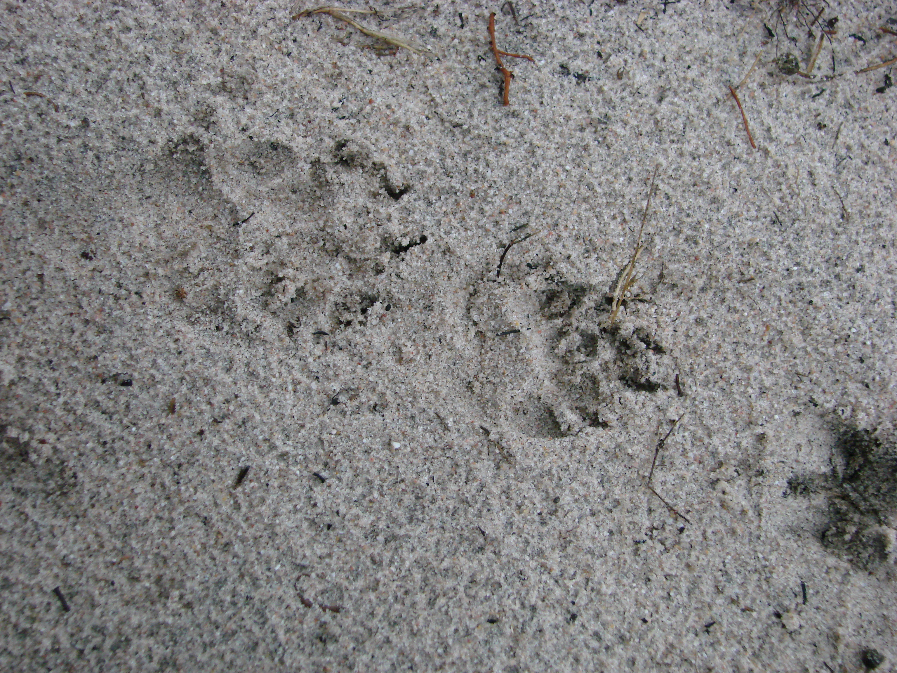

####Author: Miguel Jácome-Flores

<center> <h1>*Chamaerops humilis* Bipartite Networks analysis </h1> </center>

------------------------------------------------


##*Frugivores visits*

------------------------------------------------
<div style="width:350px; height=150px">

</div>

&nbsp;

####**Step 1. **Analysis of the aggregation area of each dwarf palm through *Dirilichet tesselations* . We use the coordinate of both males and females to obtain a proxy of aggregation.  
&nbsp;

```
library(deldir)
```

```
martcoord<-read.csv("~/Desktop/Palmito/Postdoc-Interaction Networks/Dispersal-Networks/Coordinates/BufferSelectionMartinazo.csv", header=TRUE)
deldir(martcoord)

matascoord<-read.csv("~/Desktop/Palmito/Postdoc-Interaction Networks/Dispersal-Networks/Coordinates/BufferselectionMatasgordas.csv", header=TRUE)
deldir(matascoord)
```
&nbsp;

From the summary of the obtained data.frame we use the *del.area* that use the information of all the neighbourhood and the nn to create triangular areas. It corrects using 1/3 of the total area of all the Delaunay triangles emanating from the point.The results were use to order the plants from "less to more aggegated" for a better visualization of the effect of this variable.

&nbsp;

####**Step 2. **Open Martinazo and Matasgordas matrix

&nbsp;

Opening a matrix file with weighted visits of frugivores in individual plants, the "row.names=1" is necessary to run the model and to detect the "name of plants" in the matrix. 
*Note: visit frequency= animal-visit-days/total-survey days.*

```{r opening visits matrix}
#Martinazo
mart<-read.csv("~/Desktop/Palmito/Postdoc-Interaction Networks/mart_visit.csv",header=TRUE,check.names=FALSE,row.names=1)

#Matasgordas
matas<-read.csv("~/Desktop/Palmito/Postdoc-Interaction Networks/matas_visit.csv",header=TRUE,check.names=FALSE,row.names=1)
```
&nbsp;

####**Step 3.** Using "bipartite" package. This package have functions to represent bipartite networks, and to obtain different indexes to describe the topology of the network.
&nbsp;

```
library(bipartite)
```
&nbsp;

```{r Bipartite package, message=F, cache=F, echo=F, include = FALSE}
library(bipartite)
```


#####*Step 3.1.* Ploting the web.
Creates a bipartite network were the high level will be represented by the frugivores and low level to each individual plant. Plants arrengement represents the aggregation level from high-low aggregation. This  was obtained through *Dirilichet tesselations*, where plants highly aggregated were those with the less area without any other dwarf palm. [^1]

There is an evident change on the interactions (visits/day/animal) made by deers and wildboars with a decrease in Matasgordas (second panel). Also, there is an increase of rodents, rabbits and unknown visitors (maybe be rats?)

```{r plotwebs of visits, echo=F}

par(mfrow = c(1,2))
plotweb(mart, col.low=c(gray(seq(0.1,1,length=24))),col.high=c("white","white","gray30","gray30","black","black","darkgray"),method="normal", text.rot=90,low.lablength=10, high.lablength=8) 
plotweb(matas, col.low=c(gray(seq(0.1,1,length=42))), col.high=c("white","white","gray30","gray30","black","black","darkgray"), method="normal", text.rot=90,low.lablength=10, high.lablength=8)
```

&nbsp;
&nbsp;
&nbsp;
&nbsp;

Figure 2. The first figure represent the Martinazo network and the second Matasgordas.Plants colors in gray scale [col.low=c(gray(seq(0.1,1,length=24)))], goes from black (aggregated plants) to white (more isolated), *length* refers to the number of plants in the plot. In High level, different colors in "col.high" means different guilds: white=predators, dark gray=defleshers, black=dispersers and light gray=unknow."

[^1]: <span style="color:gray">Notice: Plants colors in gray scale [col.low=c(gray(seq(0.1,1,length=24)))], goes from black (aggregated plants) to white (more isolated), *length* refers to the number of plants in the plot. In High level, different colors in "col.high" means different guilds: white=predators, dark gray=defleshers, black=dispersers and light gray=unknow.

&nbsp;


####**Step 4.** Calculate indices describing network topography of the general network. 
The reults are useful to describe the changes in different networks

&nbsp;
&nbsp;

#####**Step 4.1.** Network measures
&nbsp;

* **Network level** Analysis of bipartite webs at the level of the entire network

+ *Connectance:* Degree of specialization of the netwwork, meaure the proportion of possible links. C = L/(IJ). This is the standardized number of species combinations often used in co-occurrence analyses (Gotelli and Graves 1996); also identical to 2-species motifs sensu Milo et al. (2002).

+ *Cluster coefficient:* Mean, across all species, of the number of realized links divided by the number of possible links for each species (i.e. average per-species connectance).

+ *Web Assymethry:* Balance between numbers in the two levels W = (I– J)/(I+J). Positive numbers indicate more lower-trophic level species, negative more higher-trophic level species; rescaled to [–1, 1] (see Blüthgen et al. 2007).

+ *Nestednes and Wegihted Nestedness:* Interaction degree between specialists and the subset of species to which the generalists interact 


```{r Networklevel of Martinazo}
#Martinazo
networklevel(mart, index = c("connectance","web asymmetry","cluster coefficient","nestedness","weighted nestedness"))
```

```{r Networklevel of Matasgordas}
#Matasgordas
networklevel(matas,index = c("connectance","web asymmetry","cluster coefficient","nestedness","weighted nestedness"))
```

```{r Modularity, message=F, cache=T, echo=F, include = FALSE}
mod_mart<-computeModules(mart)
mod_matas<-computeModules(matas)
```

+ *Modularity:* Identify modules of closely interecting frugivores. Also test to what extent these modules have a spatial component. High modularity values means that the network is more stable.

Martinazo
```{r Modularity value of Martinazo, echo=FALSE}
mod_mart@likelihood
```
Matasgordas
```{r Modularity value of Matasgordas}
mod_matas@likelihood
```
Modularity in Matasgordas is higher (0.43) than Martinazo (0.28)

&nbsp;
&nbsp;

#####Ploting modules in the networks

```{r plots of the visit modules, echo=FALSE}
par(mfrow=c(1,2))
plotModuleWeb(mod_mart)
plotModuleWeb(mod_matas)
```
&nbsp;
&nbsp;
&nbsp;
&nbsp;
&nbsp;

Figure 3. 

&nbsp;

There is a change in the visitation modules. Perhaps the module in Martinazo composed by fox, rabbit and badger is related to an interactiion between animals. Both carnivorous (fox and badger) not only visit plant because of the "fruit resource" both also for the "rabbits resource". However we can rule this pattern because in Matasgordas the badger is wtihin a module with deer. Instead, it appears that the "unknwon visitors" in both populations creates their own module.


&nbsp
* **Link level.** Interaction variance between nodes. The outcome is a matrix with dependence values. Computes the contribution of each species to the overall nestedness.

```{r link level of each population}
link_lev_mart<-linklevel(mart)
link_lev_matas<-linklevel(matas)
```

&nbsp;
&nbsp;


&nbsp;

#####**Step 5.**Calculate the topography of the nodes and their relative importance to the network. Information that we can relate to the aggregation level of this plants through GLM or GAM.

There are three different levels this can be achieved at: the entire web (using function networklevel), at the level of each group (also using function networklevel) or the individual species (using function specieslevel). 

* **Relative degree.** It is a centrality measure. Proportion of interactions in relation to the potential partners in the network. Importance with the number of plants or animals with which they interact. High values in individual plants in our system is related to "more attractiveness". (qualitative characteristic of the node) interact or not

* **Species strength.** (Dorman, 2011). Describe how much the plants depends on the visits by a particular animal. Importance of the **plant** given by the porportion of visits of each animal. Instead, the values for **animals** tell us the importance of each animal given the proportion of visits that they made. 

* **Species Specificity.** Coefficient of variation of interactions, normalised to values between 0 and 1. Values of 0 indicate low, those of 1 a high variability (and hence suggesting low and high specificity). We can determine if certain **plants** have high visitation of animals or low. Instead, for **animals** we can determine if they have a high visitation or low. (quantitative index). The difference in this index is that uses the visitation values of each interaction.

* **Node specialisation index.** Another measure of specialisation, based on the path length between any two higher-trophic level species. For instance, species sharing hosts/prey have an FS-value of 1. It is a purely qualitative measure. Smaller the values, the more directly type A species are linked with type B species in network, and the less strict is the functional specialization.level of interdependence between plant and frugivore species.

* **Effective partners.** The effective number of partners, if each partner was equally common. In our study is only useful for plants.

&nbsp;
```
spp_lev_mart<-specieslevel(mart)
spp_lev_mart<-specieslevel(matas)
```
&nbsp;
&nbsp;

####Martinazo
```{r Martinazo visits node characteristics}
HLspplvlmart<-specieslevel(mart)
HLspplvlmart$`higher level`[,c(2,3,8,10)]
LLspplvlmart<-specieslevel(mart)
LLspplvlmart$`lower level`[,c(2,3,7,10,17)]
```
&nbsp;

####Matasgordas
```{r Matasgordas visits node characteristics, echo=FALSE}
spplvlmatas<-specieslevel(matas)
spplvlmatas$`higher level`[,c(2,3,8,10)]
LLspplvlmatas<-specieslevel(matas)
LLspplvlmatas$`lower level`[,c(2,3,7,10,17)]
```

&nbsp;

>*Coping the results to my folder in local repository. We'll use this file as the data.frame to analyse the centrality and its relation to the aggregation level and plants density.*

```
write.table(clos_mart, "/Users/apple/Desktop/Palmito/Postdoc-Interaction Networks/Dispersal Networks/clos_mart.txt", sep="\t")
```
&nbsp;
&nbsp;

####**Step 6.** Gathering Martinazo and Matasgordas' matrixs as one; plants are ordered from more to less aggregated

```{r Network of both populations,echo=F}
par(mfrow=c(1,1))
mart_matas_visits<-read.csv("~/Desktop/Palmito/Postdoc-Interaction Networks/mart_matas_visits.csv",header=TRUE,check.names=FALSE,row.names=1)
plotweb(mart_matas_visits, col.low=c(gray(seq(0.1,1,length=63))),col.high=c("white","white","gray30","gray30","black","black","darkgray"),method="normal", text.rot=90,low.lablength=10, high.lablength=8)
```
&nbsp;

####**Step 6.1** Calculate indices describing network topography of the general network. 

#####**Step 6.1.1** Network measures

* **Network level** Analysis of bipartite webs at the level of the entire network

+ *Connectance* 

+ *Cluster coefficient* 

+ *Web Assymethry*

+ *Nestednes and Wegihted Nestedness:*

&nbsp;
&nbsp;

```{r Networklevel of both populations}
networklevel(mart_matas_visits, index = c("connectance","web asymmetry","cluster coefficient","nestedness","weighted nestedness"))
```

+ *Modularity* 

```{r Modularity in both populations, message=F, cache=T, echo=F, include = FALSE}
mod_mart_matas_v<-computeModules(mart_matas_visits)
```


Matasgordas y Martinazo
```{r Modularity value of both populations, echo=FALSE}
mod_mart_matas_v@likelihood
```

#####Ploting modules in the networks

```{r plots of the modules of both populations in one, echo=FALSE}
par(mfrow=c(1,1))
plotModuleWeb(mod_mart_matas_v)
```
&nbsp;
&nbsp;
&nbsp;
&nbsp;
&nbsp;

Figure 3.

&nbsp;

It doesn't make many sense unless the plants have similar characteritics. There is a module where rabbit, rodents and deers apper to form a unique module. Perhaps, the plants are the aggregated ones, however, the results can change due to iteration process.


&nbsp
* **Link level.** Interaction variance between nodes. The outcome is a matrix with dependence values. Computes the contribution of each species to the overall nestedness.

```{r link level value of both populations}
linklevel(mart_matas_visits)
```

&nbsp;
&nbsp;
&nbsp;

#####**Step 6.1.2.**Calculate the topography of the nodes and their relative importance to the network. 

* **Relative degree.** 

* **Species strength.**  

* **Species Specificity.** 

* **Node specialisation index.** 

* **Effective partners.** 

&nbsp;
```
spp_lev_mart<-specieslevel(mart_matas_visits)
```

```{r Martinazo and Matasgordas visits node characteristics}
HLspplvlmart<-specieslevel(mart_matas_visits)
HLspplvlmart$`higher level`[,c(2,3,8,10)]
LLspplvlmart<-specieslevel(mart_matas_visits)
LLspplvlmart$`lower level`[,c(2,3,7,10,17)]
```

&nbsp;
&nbsp;
&nbsp;

