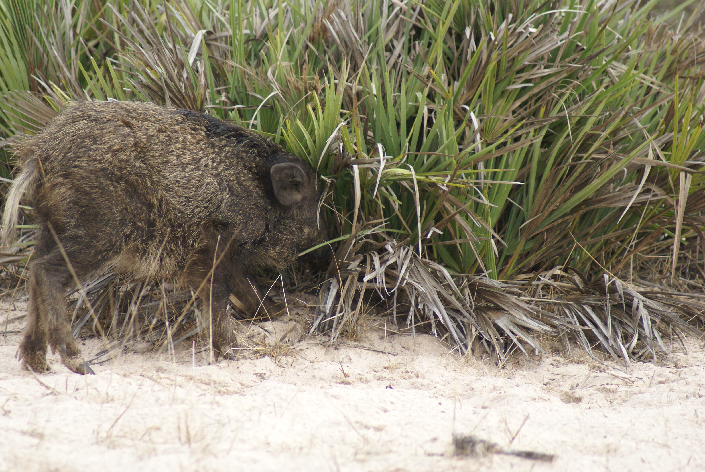

####Author: Miguel Jácome-Flores

<center> <h1>*Chamaerops humilis* Bipartite Networks analysis </h1> </center>

------------------------------------------------


##*Frugivores visits*

------------------------------------------------


&nbsp;

####**Step 1. **Open Martinazo and Matasgordas matrix


Opening a matrix file with weighted visits of frugivores in individual plants, the "row.names=1" is necessary to run the model and to detect the "name of plants" in the matrix. 
*Note: visit frequency= animal-visit-days/total-survey days.*

```{r}
#Martinazo
mart<-read.csv("~/Desktop/Palmito/Postdoc-Interaction Networks/mart_visit.csv",header=TRUE,check.names=FALSE,row.names=1)

#Matasgordas
matas<-read.csv("~/Desktop/Palmito/Postdoc-Interaction Networks/matas_visit.csv",header=TRUE,check.names=FALSE,row.names=1)
```
&nbsp;

####**Step 2.** Using "bipartite" package
&nbsp;

```
library(bipartite)
```
&nbsp;

```{r, message=F, cache=F, echo=F, include = FALSE}
library(bipartite)
```


#####*Step 2.1.* Ploting the web.
Creates a bipartite network were the high level will be represented by the frugivores and low level to each individual plant. Plants arrengement represents the aggregation level from high-low aggregation. This  was obtained through *Dirilichet tesselations*, where plants haighly aggregated were those with the less area without any other dwarf palm. [^1]

```{r plotwebs, echo=F}

par(mfrow = c(2,1))
plotweb(mart, col.low=c(gray(seq(0.1,1,length=24))),col.high=c("white","white","gray30","gray30","black","black","darkgray"),method="normal", text.rot=90,low.lablength=10, high.lablength=8) 
plotweb(matas, col.low=c(gray(seq(0.1,1,length=42))), col.high=c("white","white","gray30","gray30","black","black","darkgray"), method="normal", text.rot=90,low.lablength=10, high.lablength=8)
```


[^1]: <span style="color:gray">Notice: Plants colors in gray scale [col.low=c(gray(seq(0.1,1,length=24)))], goes from black (aggregated plants) to white (more isolated), *length* refers to the number of plants in the plot. In High level, different colors in "col.high" means different guilds: white=predators, dark gray=defleshers, black=dispersers and light gray=unknow.

&nbsp;

####**Step 3.** Calculate indices describing network topography. 

There are three different levels this can be achieved at: the entire web (using function networklevel), at the level of each group (also using function networklevel) or the individual species (using function specieslevel). One of the best measures in network analysis is the centrality. This index refer to the relative importance of every element to structure the system and there are three measures of closeness useful for us.

#####**Step 3.1.** Centrality measures

* **Relative degree.** Proportion of interactions in relation to the potential partners in the network. Importance with the number of plants or animals with which they interact

* **Closeness.** Refered to the distance from the species to all other species in the network, mesaured as **degrees of separation**. It`s usally used as a proxy for species niche commoness or funcitonal influence in a network. **How similar their interactions are to the interaction set made by other species.**  

* **Betweenness.** Proportion of small paths (shortest distances measured through direct or inderect connections) between all pair of species in the network. It's used as a proxy for the species for binding different modules or regions of the network. 
*Note: for multilayer networks refer to how strongly bind different modules in the networks and each layer sparetely.*
&nbsp;
```
spp_lev_mart<-specieslevel(mart)
spp_lev_mart<-specieslevel(matas)
```

```{r, message=F, cache=F, echo=F, include = FALSE}
spp_lev_mart<-specieslevel(mart)
spp_lev_matas<-specieslevel(matas)
```

Maritnazo
```{r,echo=FALSE}
names(spp_lev_mart$`higher level`)[2]<-"ND"
names(spp_lev_mart$`higher level`)[11]<-"Betwn"
names(spp_lev_mart$`higher level`)[12]<-"W.Betwn"
names(spp_lev_mart$`higher level`)[13]<-"Closn"
names(spp_lev_mart$`higher level`)[14]<-"W.Closn"

knitr::kable((spp_lev_mart$`higher level`[,c(2,11,12,13,14)]))

```

```{r,echo=FALSE}

names(spp_lev_mart$`lower level`)[2]<-"ND"
names(spp_lev_mart$`lower level`)[11]<-"Betwn"
names(spp_lev_mart$`lower level`)[12]<-"W.Betwn"
names(spp_lev_mart$`lower level`)[13]<-"Closn"
names(spp_lev_mart$`lower level`)[14]<-"W.Closn"
knitr::kable((spp_lev_mart$`lower level`[,c(2,11,12,13,14)]))

```

Matasgordas
```{r,echo=FALSE}
names(spp_lev_matas$`higher level`)[2]<-"ND"
names(spp_lev_matas$`higher level`)[11]<-"Betwn"
names(spp_lev_matas$`higher level`)[12]<-"W.Betwn"
names(spp_lev_matas$`higher level`)[13]<-"Closn"
names(spp_lev_matas$`higher level`)[14]<-"W.Closn"

knitr::kable((spp_lev_matas$`higher level`[,c(2,11,12,13,14)]))

```

```{r,echo=FALSE}

names(spp_lev_matas$`lower level`)[2]<-"ND"
names(spp_lev_matas$`lower level`)[11]<-"Betwn"
names(spp_lev_matas$`lower level`)[12]<-"W.Betwn"
names(spp_lev_matas$`lower level`)[13]<-"Closn"
names(spp_lev_matas$`lower level`)[14]<-"W.Closn"
knitr::kable((spp_lev_matas$`lower level`[,c(2,11,12,13,14)]))
```


#####**Step 3.2.** Network measures

* **Link level** computes the contribution of each species to the overall nestedness.

* **Network level** Analysis of bipartite webs at the level of the entire network

+ **Connectance:** Realized proportion of possible links. C = L/(IJ). This is the standardized number of species combinations often used in co-occurrence analyses (Gotelli and Graves 1996); also identical to 2-species motifs sensu Milo et al. (2002).

+ **Cluster coefficient:** Mean, across all species, of the number of realized links divided by the number of possible links for each species (i.e. average per-species connectance).

+ **Web Assymethry:** Balance between numbers in the two levels W = (I– J)/(I+J). Positive numbers indicate more lower-trophic level species, negative more higher-trophic level species; rescaled to [–1, 1] (see Blüthgen et al. 2007).

```{r, message=F, cache=F, echo=F, include = FALSE}
mod_mart<-computeModules(mart)
link_lev_mart<-linklevel(mart)

mod_matas<-computeModules(matas)
link_lev_matas<-linklevel(matas)
```

```{r}
#Martinazo
networklevel(mart)
```

```{r}
#Matasgordas
networklevel(matas)
```

&nbsp;
&nbsp;


#####**Step 3.3.** Ploting modules in the networks

```{r, echo=FALSE}
par(mfrow=c(1,2))
plotModuleWeb(mod_mart)
plotModuleWeb(mod_matas)
```

&nbsp;

>**Coping the results to my folder in local repository**

```
write.table(clos_mart, "/Users/apple/Desktop/Palmito/Postdoc-Interaction Networks/Dispersal Networks/clos_mart.txt", sep="\t")
```

--------------------------------------------------------


##*Fruit remotion rates*

-------------------------



&nbsp;

####**Step 1. **Open Martinazo and Matasgordas matrix

Opening a matrix file with weighted links with frugivores fruit remotion in individual plants. Other specifications of the matrix are described in the previous section.


```{r}
#Martinazo
mart_f<-read.csv("~/Desktop/Palmito/Postdoc-Interaction Networks/mart_fruits.csv",header=TRUE,check.names=FALSE,row.names=1)

#Matasgordas
matas_f<-read.csv("~/Desktop/Palmito/Postdoc-Interaction Networks/matas_fruits.csv",header=TRUE,check.names=FALSE,row.names=1)
```

&nbsp;

####**Step 2.** Using "bipartite" package 
&nbsp;

```
library(biparite)
```
&nbsp;
&nbsp;

#####*Step 2.1.* Ploting the web.
Creates a bipartite network were the high level will be represented by the frugivores and low level to each individual plant. *Links are weigthed with the proportion fruit remotion proportion/animal/individual plant*.[^2] 

[^2]: <span style="color:gray">For more information see previous analysis

```{r,echo=FALSE}
#Martinazo Bipartite network
par(mfrow = c(2,1))
plotweb(mart_f, col.low=c(gray(seq(0.1,1,length=24))), col.high=c("white","white","gray30","gray30","black","black","darkgray"),method="normal", text.rot=90,low.lablength=10, high.lablength=8)

#Matasgordas Bipartite Network
plotweb(matas_f, col.low=c(gray(seq(0.1,1,length=39))), col.high=c("white","white","gray30","gray30","black","black","darkgray"), method="normal", text.rot=90,low.lablength=10, high.lablength=8)
```

####**Step 3.** Calculate indices describing network topography. 

There are three different levels this can be achieved at: the entire web (using function networklevel), at the level of each group (also using function networklevel) or the individual species (using function specieslevel). One of the best measures in network analysis is the centrality. This index refer to the relative importance of every element to structure the system and there are three measures of closeness useful for us.[^2]
&nbsp;
#####**Step 3.1.** Centrality measures

* **Relative degree.** 

* **Closeness** 

* **Betweenness** 

&nbsp;
```
spp_lev_mart_f<-specieslevel(mart_f)
spp_lev_matas_f<-specieslevel(matas)
```

```{r, message=F, cache=F, echo=F, include = FALSE}
spp_lev_mart_f<-specieslevel(mart_f)
spp_lev_matas_f<-specieslevel(matas_f)
```

&nbsp;
Martinazo
```{r,echo=FALSE}
names(spp_lev_mart_f$`higher level`)[2]<-"ND"
names(spp_lev_mart_f$`higher level`)[11]<-"Betwn"
names(spp_lev_mart_f$`higher level`)[12]<-"W.Betwn"
names(spp_lev_mart_f$`higher level`)[13]<-"Closn"
names(spp_lev_mart_f$`higher level`)[14]<-"W.Closn"

knitr::kable((spp_lev_mart_f$`higher level`[,c(2,11,12,13,14)]))

```
&nbsp;
```{r,echo=FALSE}

names(spp_lev_mart_f$`lower level`)[2]<-"ND"
names(spp_lev_mart_f$`lower level`)[11]<-"Betwn"
names(spp_lev_mart_f$`lower level`)[12]<-"W.Betwn"
names(spp_lev_mart_f$`lower level`)[13]<-"Closn"
names(spp_lev_mart_f$`lower level`)[14]<-"W.Closn"
knitr::kable((spp_lev_mart_f$`lower level`[,c(2,11,12,13,14)]))
```
Matasgordas
```{r,echo=FALSE}
names(spp_lev_matas_f$`higher level`)[2]<-"ND"
names(spp_lev_matas_f$`higher level`)[11]<-"Betwn"
names(spp_lev_matas_f$`higher level`)[12]<-"W.Betwn"
names(spp_lev_matas_f$`higher level`)[13]<-"Closn"
names(spp_lev_matas_f$`higher level`)[14]<-"W.Closn"

knitr::kable((spp_lev_matas_f$`higher level`[,c(2,11,12,13,14)]))

```

```{r,echo=FALSE}

names(spp_lev_matas_f$`lower level`)[2]<-"ND"
names(spp_lev_matas_f$`lower level`)[11]<-"Betwn"
names(spp_lev_matas_f$`lower level`)[12]<-"W.Betwn"
names(spp_lev_matas_f$`lower level`)[13]<-"Closn"
names(spp_lev_matas_f$`lower level`)[14]<-"W.Closn"
knitr::kable((spp_lev_matas_f$`lower level`[,c(2,11,12,13,14)]))
```


#####**Step 3.2.** Network measures

* **Link level** computes the contribution of each species to the overall nestedness.

* **Network level** Analysis of bipartite webs at the level of the entire network

+ **Connectance:** Realized proportion of possible links. C = L/(IJ). This is the standardized number of species combinations often used in co-occurrence analyses (Gotelli and Graves 1996); also identical to 2-species motifs sensu Milo et al. (2002).

+ **Cluster coefficient:** Mean, across all species, of the number of realized links divided by the number of possible links for each species (i.e. average per-species connectance).

+ **Web Assymethry:** Balance between numbers in the two levels W = (I– J)/(I+J). Positive numbers indicate more lower-trophic level species, negative more higher-trophic level species; rescaled to [–1, 1] (see Blüthgen et al. 2007).

```{r, message=F, cache=F, echo=F, include = FALSE}
mod_mart_f<-computeModules(mart_f)
link_lev_mart_f<-linklevel(mart_f)

mod_matas_f<-computeModules(matas_f)
link_lev_matas<-linklevel(matas_f)
```

```{r}
#Martinazo
networklevel(mart_f)
```

```{r}
#Matasgordas
networklevel(matas_f)
```


&nbsp;

#####**Step 3.3.** Ploting modules in the networks

```{r, echo=FALSE}
par(mfrow=c(1,2))
plotModuleWeb(mod_mart_f)
plotModuleWeb(mod_matas_f)
```
&nbsp;
&nbsp;
&nbsp;
&nbsp;
&nbsp;
&nbsp;
&nbsp;
&nbsp;
&nbsp;
&nbsp;
&nbsp;
&nbsp;
&nbsp;
&nbsp;
&nbsp;
&nbsp;
&nbsp;
&nbsp;
&nbsp;
&nbsp;
&nbsp;
&nbsp;
&nbsp;
&nbsp;
&nbsp;
&nbsp;
&nbsp;
&nbsp;
&nbsp;
&nbsp;
&nbsp;
&nbsp;
&nbsp;
&nbsp;
&nbsp;
&nbsp;
&nbsp;
&nbsp;
&nbsp;
&nbsp;

####**Step 4.** Gathering Martinazo and Matasgordas' matrixs as one; plants are ordered from more to less aggregated

```{r,echo=F}
par(mfrow=c(1,1))
mart_matas_fruits<-read.csv("~/Desktop/Palmito/Postdoc-Interaction Networks/Mart_matas_fruits.csv",header=TRUE,check.names=FALSE,row.names=1)
plotweb(mart_matas_fruits, col.low=c(gray(seq(0.1,1,length=56))), col.high=c("white","white","gray30","gray30","black","black","darkgray"),method="normal", text.rot=90,low.lablength=10, high.lablength=8)
```

&nbsp;

####**Step 5.** Changing the matrix by eliminating unknown visitors

```{r}
#Martinazo
mart_fnun<-read.csv("~/Desktop/Palmito/Postdoc-Interaction Networks/mart_fruits_no_unk.csv",header=TRUE,check.names=FALSE,row.names=1)

#Matasgordas
matas_fnun<-read.csv("~/Desktop/Palmito/Postdoc-Interaction Networks/matas_fruits_no_unk.csv",header=TRUE,check.names=FALSE,row.names=1)
```
&nbsp;

#####Bipartite plot

```{r,echo=FALSE}
#Martinazo Bipartite Network
par(mfrow=c(2,1))
plotweb(mart_fnun, col.low=c(gray(seq(0.1,1,length=22))), col.high=c("white","white","gray30","gray30","black","black","darkgray"),method="normal", text.rot=90,low.lablength=10, high.lablength=8)

#Matasgordas Bipartite Network
plotweb(matas_fnun, col.low=c(gray(seq(0.1,1,length=30))), col.high=c("white","white","gray30","gray30","black","black","darkgray"),method="normal", text.rot=90,low.lablength=10, high.lablength=8)
```