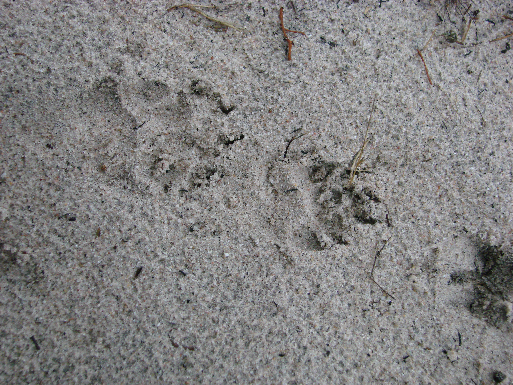

<right> <h1>Author: Miguel Jácome-Flores</h1> </right>


<center> <h1>*Chamaerops humilis* Bipartite Networks analysis </h1> </center>

------------------------------------------------


##*Frugivores visits*

------------------------------------------------




####**Step 1. **Open Martinazo and Matasgordas matrix


Opening a matrix file with weighted visits of frugivores in individual plants, the "row.names=1" is necessary to run the model and to detect the "name of plants" in the matrix. 
*Note: visit frequency= animal-visit-days/total-survey days.*

```{r}
#Martinazo
mart<-read.csv("~/Desktop/Palmito/Postdoc-Interaction Networks/mart_visit.csv",header=TRUE,check.names=FALSE,row.names=1)
mart
row.names(mart)

#Matasgordas
matas<-read.csv("~/Desktop/Palmito/Postdoc-Interaction Networks/matas_visit.csv",header=TRUE,check.names=FALSE,row.names=1)
matas
row.names(matas)
```


####**Step 2.** Using "bipartite" package 


#####*Step 2.1.* Ploting the web.
Creates a bipartite network were the high level will be represented by the frugivores and low level to each individual plant. Plants arrengement represents the aggregation level from high-low aggregation. This  was obtained through *Dirilichet tesselations*, where plants haighly aggregated were those with the less area without any other dwarf palm. [^1]

```{r,echo=FALSE}
#Martinazo Bipartite network
par(mfrow = c(2,1))   #Creating the space for the two population networks
plotweb(mart, col.low=c(gray(seq(0.1,1,length=24))), col.high=c("white","white","gray30","gray30","black","black","darkgray"),method="normal", text.rot=90,low.lablength=10, high.lablength=8) 

#Matasgordas Bipartite Network
plotweb(matas, col.low=c(gray(seq(0.1,1,length=42))), col.high=c("white","white","gray30","gray30","black","black","darkgray"), method="normal", 
        text.rot=90,low.lablength=10, high.lablength=8)
```

[^1]: <span style="color:gray">Notice: Plants colors in gray scale [col.low=c(gray(seq(0.1,1,length=24)))], goes from black (aggregated plants) to white (more isolated), *length* refers to the number of plants in the plot. In High level, different colors in "col.high" means different guilds: white=predators, dark gray=defleshers, black=dispersers and light gray=unknow.


####**Step 3.** Calculate different indexes of a network.

* **Closeness** scores for nodes in a weighted network based on the distance_w-function.

* **Betweenness** scores for nodes in a weighted network based on the distance_w-function.

* **Species level** describe a species' degree as sum of its links.

* **Link level** computes the contribution of each species to the overall nestedness.


```{r}
clos_mart<-closeness_w(mart, gconly=TRUE, precomp.dist=NULL, alpha=1)
bet_mart<-betweenness_w(mart)
mod_mart<-computeModules(mart)
spp_lev_mart<-specieslevel(mart)
link_lev_mart<-linklevel(mart)

clos_mart<-closeness_w(matas, gconly=TRUE, precomp.dist=NULL, alpha=1)
bet_mart<-betweenness_w(matas)
mod_mart<-computeModules(matas)
spp_lev_mart<-specieslevel(matas)
link_lev_mart<-linklevel(matas)
```

>**Coping the results to my folder in local repository**

```
write.table(clos_mart, "/Users/apple/Desktop/Palmito/Postdoc-Interaction Networks/Dispersal Networks/clos_mart.txt", sep="\t")
```

--------------------------------------------------------


##*Fruit remotion rates*

-------------------------


####**Step 1. **Open Martinazo and Matasgordas matrix

Opening a matrix file with weighted links with frugivores fruit remotion in individual plants. Other specifications of the matrix are described in the previous section.


```{r}
#Martinazo
mart_f<-read.csv("~/Desktop/Palmito/Postdoc-Interaction Networks/mart_fruits.csv",header=TRUE,check.names=FALSE,row.names=1)
mart_f
row.names(mart_f)

#Matasgordas
matas_f<-read.csv("~/Desktop/Palmito/Postdoc-Interaction Networks/matas_fruits.csv",header=TRUE,check.names=FALSE,row.names=1)
matas_f
row.names(matas_f)
```


####**Step 2.** Using "bipartite" package 

#####*Step 2.1.* Ploting the web.
Creates a bipartite network were the high level will be represented by the frugivores and low level to each individual plant. *Links are weigthed with the proportion fruit remotion proportion/animal/individual plant*.[^2] 

[^2]: <span style="color:gray">For more information see previous analysis

```{r,echo=FALSE}
#Martinazo Bipartite network
par(mfrow = c(2,1))
plotweb(mart_f, col.low=c(gray(seq(0.1,1,length=24))), col.high=c("white","white","gray30","gray30","black","black","darkgray"),method="normal", text.rot=90,low.lablength=10, high.lablength=8)

#Matasgordas Bipartite Network
plotweb(matas_f, col.low=c(gray(seq(0.1,1,length=39))), col.high=c("white","white","gray30","gray30","black","black","darkgray"), method="normal", text.rot=90,low.lablength=10, high.lablength=8)
```

####**Step 3.** Calculate different indexes of a network.[^2]

* **Closeness** 

* **Betweenness** 

* **Species level** 

* **Link level** 

```{r}
clos_mart_f<-closeness_w(mart_f, gconly=TRUE, precomp.dist=NULL, alpha=1)
bet_mart_f<-betweenness_w(mart_f)
mod_mart_f<-computeModules(mart_f)
spp_lev_mart_f<-specieslevel(mart_f)
link_lev_mart_f<-linklevel(mart_f)

clos_matas_f<-closeness_w(matas_f, gconly=TRUE, precomp.dist=NULL, alpha=1)
bet_matas_f<-betweenness_w(matas_f)
mod_matas_f<-computeModules(matas_f)
spp_lev_matas_f<-specieslevel(matas_f)
link_lev_matas_f<-linklevel(matas_f)
```

#####**Step 3.1.** Plotong modules in the networks

```{r}
par(mfrow=c(1,2))
plotModuleWeb(mod_mart_f)
plotModuleWeb(mod_matas_f)
```


####**Step 4.** Gathering Martinazo and Matasgordas' matrixs as one; plants are ordered from more  to less aggregated

```{r}
-par(mfrow=c(1,1))
-mart_matas_fruits<-read.csv("~/Desktop/Palmito/Postdoc-Interaction Networks/Mart_matas_fruits.csv",header=TRUE,check.names=FALSE,row.names=1)
-plotweb(mart_matas_fruits, col.low=c(gray(seq(0.1,1,length=56))), col.high=c("white","white","gray30","gray30","black","black","darkgray"),method="normal", text.rot=90,low.lablength=10, high.lablength=8)
```


####**Step 5.** Changing the matrix by eliminating unknown visitors

```{r}
#Maritnazo
-mart_fnun<-read.csv("~/Desktop/Palmito/Postdoc-Interaction Networks/mart_fruits_no_unk.csv",header=TRUE,check.names=FALSE,row.names=1)

#Matasgordas
-matas_fnun<-read.csv("~/Desktop/Palmito/Postdoc-Interaction Networks/matas_fruits_no_unk.csv",header=TRUE,check.names=FALSE,row.names=1)
```

#####Bipartite plot

```{r,echo=FALSE}
#Martinazo Bipartite Network
-par(mfrow=c(2,1))
-plotweb(mart_fnun, col.low=c(gray(seq(0.1,1,length=22))), col.high=c("white","white","gray30","gray30","black","black","darkgray"),method="normal", text.rot=90,low.lablength=10, high.lablength=8)

#Matasgordas Bipartite Network
plotweb(matas_fnun, col.low=c(gray(seq(0.1,1,length=30))), col.high=c("white","white","gray30","gray30","black","black","darkgray"),method="normal", text.rot=90,low.lablength=10, high.lablength=8)
```